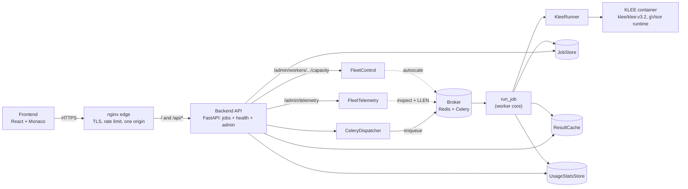
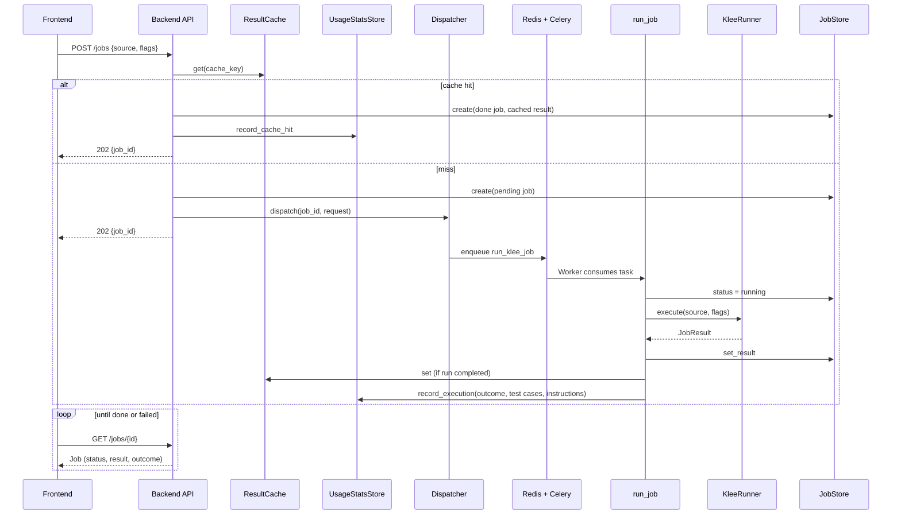

# Architecture

How KLEE Web fits together. This is the map for a new contributor: what the pieces are and how a job flows through them. The ADRs in [`adr/`](adr/) record why each decision was made. The [top-level README](../README.md) covers how to run it. This document is the middle layer, the how-it-connects.

The system takes C source from a browser, runs KLEE inside a gVisor container, and returns the generated test cases. Stable HTTP and Protocol boundaries carried the system from the Stage 1 monolith to the Stage 2 split without changing the frontend contract. The current system supports one full-application topology through Compose (ADR-0024).

## The big picture

The API is thin: it validates the request, checks the cache, and hands each miss to `CeleryDispatcher`. A Worker consumes the task and is the only application service that touches Docker and KLEE. Redis holds the store, cache, usage counters, and broker state shared by the API and Worker. The frontend and API sit behind an nginx edge (TLS, rate limiting, one origin). The same FastAPI process serves health probes and admin operations: telemetry from Celery `inspect` plus a broker `LLEN`, usage from Redis counters, and Worker capacity through Celery remote control.

## Components

Each unit has one job, is reached through an interface, and can be swapped without the others knowing. The units marked `Protocol` are the swap seams (see below).

| Unit | What it does | How you use it | Depends on |
|--|--|--|--|
| **Frontend** (`frontend/`) | Monaco editor for C input, results panel. Submits a job and polls for the result (every 1s). | Open the app, type C, click Run. | The backend HTTP API only. |
| **Backend API** (`api/jobs.py`) | Three endpoints: `POST /jobs`, `GET /jobs/{id}`, `POST /jobs/{id}/cancel`. Validates, reads the cache, dispatches. | The frontend calls it. Takes the seams via FastAPI `Depends`. | `JobStore`, `JobDispatcher`, `ResultCache`, `UsageStatsStore`. |
| **Ops API** (`api/health.py`, `api/admin.py`) | `GET /health` (liveness), `GET /ready` (readiness), admin telemetry and usage reads, and per-worker maximum-capacity writes. | Compose polls readiness and the browser polls liveness. The admin UI reads telemetry and stats and changes worker capacity. nginx gates `/admin` and `/api/admin/*` at the edge. | `Readiness`, `FleetTelemetry`, `FleetControl`, `UsageStatsStore`. |
| **JobStore** (`jobs/store.py`, `Protocol`) | Holds each `Job` (status, result, cancel flag). | `create`, `get`, `set_result`, `request_cancel`, ... | Redis. |
| **KleeRunner** (`jobs/runner.py`, `Protocol`) | Runs one KLEE job in a container and parses the output into a `JobResult`. | `execute(source, flags, job_id, ...)`, `cancel(job_id)`. | Docker and the runner image. |
| **ResultCache** (`jobs/cache.py`, `Protocol`) | Caches finished results keyed by a hash of the submission (source + flags). | `get(key)`, `set(key, result)`. | Redis. |
| **JobDispatcher** (`jobs/dispatch.py`, `Protocol`) | Enqueues a complete Job request for Worker execution. | `dispatch(job_id, request)`. | Celery + Redis broker. |
| **run_job** (`jobs/run.py`) | The FastAPI-free core of a run: drive status transitions, call the Runner, watch for cancel, write the result, populate the cache, record the outcome. | Called by the Celery task. | `JobStore`, `KleeRunner`, `ResultCache`, `UsageStatsStore`. |
| **Readiness** (`health.py`, `Protocol`) | Reports whether the service can serve by pinging Redis. | `is_ready()`. | Redis. |
| **FleetTelemetry** (`jobs/telemetry.py`, `Protocol`) | Live fleet view: Worker pool sizes, active/reserved Jobs, queue depth (Celery `inspect` + a broker `LLEN`). | `snapshot()`. | Celery + Redis broker. |
| **FleetControl** (`jobs/telemetry.py`, `Protocol`) | Changes one Worker's autoscaler maximum, bounded by the deployment setting. | `set_max_concurrency(worker_name, maximum)`. | Celery remote control. |
| **UsageStatsStore** (`jobs/usage.py`, `Protocol`) | Cumulative counters: outcomes per kind, cache hits, aggregate KLEE totals. | `record_execution`, `record_cache_hit`, `snapshot`. | Redis `INCR`. |
| **Runner image** (`runner/`) | The Docker image (based on `klee/klee:v3.2`) and `entrypoint.py`: compile C to LLVM bitcode with clang, run KLEE (`--kdalloc=false`), replay each test case through the fork-per-ktest zygote for per-path output, capture output (ADR-0020, ADR-0022). | Built locally by `make runner` or selected through `RUNNER_IMAGE`. One container per job, launched under the `KLEE_RUNTIME` sandbox with no network, a read-only root, and bounded temporary storage at `/work` (ADR-0023). | KLEE, clang, Docker. |
| **Broker** (`celery_app.py`) | The queue between the API and Workers. Carries the `run_klee_job` task. | `CeleryDispatcher` publishes and Workers consume. | Redis. |
| **Settings** (`config.py`) | Validates infrastructure URLs, Runner image, sandbox runtime, Runner Caps, and Worker-capacity bound. | Required `REDIS_URL` and `CELERY_BROKER_URL`. `RUNNER_IMAGE`, `KLEE_RUNTIME`, the Runner Caps, and `WORKER_CONCURRENCY_MAX` have deployment defaults. | pydantic-settings. |

## The request lifecycle

The contract has been async-shaped since Stage 1 (ADR-0007): `POST /jobs` returns a `job_id` immediately, and the frontend polls `GET /jobs/{id}`. Stage 1 used the same contract before execution moved onto a Worker. That early boundary is why the current queue topology required no endpoint or frontend rewrite.

Two paths worth calling out:

- **Cache hit.** An identical resubmission (same source and flags) short-circuits: the API stores a job already `done` with the cached result and never touches the queue (ADR-0017).
- **Cancel.** `POST /jobs/{id}/cancel` is an API-side eager flip: the endpoint writes the terminal `cancelled` result into the store itself, so a job resolves even if no worker is alive to act on it. A running worker's watcher also signals the container so KLEE can halt and flush the output available at termination. Stream transport does not deliver incremental results while the container is still running (ADR-0013, ADR-0018, ADR-0021).

## The Protocol seams

The `Protocol`s separate HTTP and core Job logic from infrastructure. FastAPI endpoints receive them through `Depends`, while `run_job` receives them as ordinary arguments. Production has one implementation per seam. Tests inject deterministic fakes directly without shipping those fakes in the application package.

| Seam | Production implementation | Test implementation |
|--|--|--|
| `JobStore` | `RedisJobStore` | `FakeJobStore` |
| `ResultCache` | `RedisResultCache` | `FakeResultCache` |
| `JobDispatcher` | `CeleryDispatcher` | `FakeJobDispatcher` |
| `KleeRunner` | `DockerKleeRunner` in the Worker | `FakeKleeRunner` |
| `Readiness` | `RedisReadiness` | Focused test stubs |
| `UsageStatsStore` | `RedisUsageStatsStore` | `FakeUsageStatsStore` |
| `FleetTelemetry` | `CeleryFleetTelemetry` | Focused test stubs |
| `FleetControl` | `CeleryFleetControl` | Focused test stubs |

`REDIS_URL` and `CELERY_BROKER_URL` are required. FastAPI validates them during startup, before it serves traffic. The API construction seam builds Redis and Celery services. The Worker construction seam additionally builds `DockerKleeRunner`.

## Deployment shape

Compose is the one full-application topology for local verification, browser CI, and deployment:

- **`make deploy`** builds the Runner, backend, and frontend images, then starts nginx, FastAPI, Redis, and one Celery Worker in detached mode.
- **`make deploy WORKER_REPLICAS=2`** scales the Worker service. `WORKER_CONCURRENCY_MAX` independently bounds each Worker's autoscaler.
- **`make logs`** follows all service logs without owning their lifecycle.
- **`make down`** removes the service containers and network while preserving the Redis named volume.

Compose defaults to the local `klee-web-backend`, `klee-web-frontend`, and `klee-web-runner` image names. `make deploy` builds that local path. Registry-backed deployment tooling can supply tags or digests through `BACKEND_IMAGE`, `FRONTEND_IMAGE`, and `RUNNER_IMAGE`, pull them, and start the same services with `docker compose up --no-build`.

After all six checks pass in a `main` CI run, CI calls the reusable `Publish images` workflow. It builds the three `linux/amd64` images in GHCR under immutable `sha-<full-commit>` tags and signs their provenance with GitHub's Sigstore identity. Main CI runs complete independently, but only the commit that remains the tip of `main` can update the three moving `main` tags. Publishing a stable GitHub Release verifies all three attestations before adding its `vMAJOR.MINOR.PATCH` tag to those existing manifests without rebuilding. No `latest` tag is published.

Make selects `runsc-kvm` when the host exposes `/dev/kvm` and `runsc` otherwise. Supported deployments use that gVisor selection. `runc` remains available only as a comparative integration-test control. The Worker launches each Job as a sibling Runner container through the host Docker socket. nginx serves the built frontend and reverse-proxies `/api` over TLS. Redis persists through AOF on a named volume, bounded by `maxmemory` with `volatile-lru` eviction.

Provider-specific deployment work belongs around this topology rather than inside an application-mode selector. Terraform, image references, host provisioning, network addresses, and gVisor installation form the redeployment delta measured by the portability study.

## Where to look next

- **Why a decision was made:** the ADRs in [`adr/`](adr/), one per major choice.
- **How to run it locally:** the [top-level README](../README.md), and [`backend/README.md`](../backend/README.md) for Worker and failure details.
- **The live API contract:** Swagger UI at `https://localhost/api/docs` when the stack is running. `/api` is the nginx URL prefix and is stripped before FastAPI receives `/docs`.
