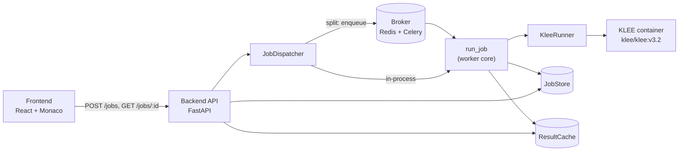
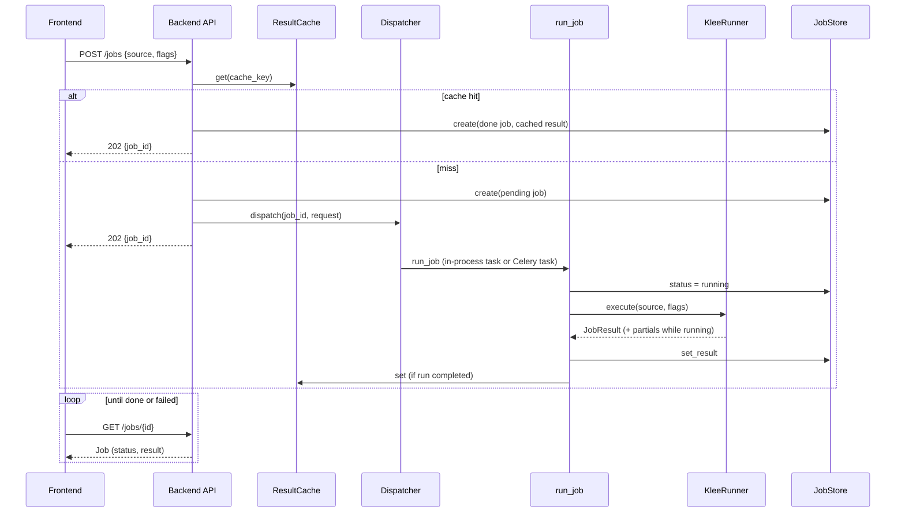

# Architecture

How KLEE Web fits together. This is the map for a new contributor: what the pieces are and how a job flows through them. The ADRs in [`adr/`](adr/) record why each decision was made. The [top-level README](../README.md) covers how to run it. This document is the middle layer, the how-it-connects.

The system takes C source from a browser, runs KLEE on it inside a Docker container, and returns the generated test cases. The whole design follows one principle: each stage adds capability behind stable interfaces, it never rewrites the last (ADR-0001). So the same request flow holds whether the job runs in the API process (Stage 1) or on a separate Celery worker (Stage 2). Only the wiring behind the interfaces changes.

## The big picture

The API is thin: it validates the request, checks the cache, and hands the job to a dispatcher. The dispatcher decides where the real work runs. The runner is the only part that touches Docker and KLEE. The store and cache are shared state that both the API and the worker read and write.

## Components

Each unit has one job, is reached through an interface, and can be swapped without the others knowing. The four marked `Protocol` are the swap seams (see below).

| Unit | What it does | How you use it | Depends on |
|--|--|--|--|
| **Frontend** (`frontend/`) | Monaco editor for C input, results panel. Submits a job and polls for the result (every 1s). | Open the app, type C, click Run. | The backend HTTP API only. |
| **Backend API** (`api/jobs.py`) | Three endpoints: `POST /jobs`, `GET /jobs/{id}`, `POST /jobs/{id}/cancel`. Validates, reads the cache, dispatches. | The frontend calls it. Takes the seams via FastAPI `Depends`. | `JobStore`, `JobDispatcher`, `ResultCache`. |
| **JobStore** (`jobs/store.py`, `Protocol`) | Holds each `Job` (status, result, cancel flag). | `create`, `get`, `set_result`, `request_cancel`, ... | Nothing (in-memory) or Redis. |
| **KleeRunner** (`jobs/runner.py`, `Protocol`) | Runs one KLEE job in a container and parses the output into a `JobResult`. | `execute(source, flags, job_id, ...)`, `cancel(job_id)`. | Docker and the runner image. |
| **ResultCache** (`jobs/cache.py`, `Protocol`) | Caches finished results keyed by a hash of the submission (source + flags). | `get(key)`, `set(key, result)`. | Nothing (in-memory) or Redis. |
| **JobDispatcher** (`jobs/dispatch.py`, `Protocol`) | Decides where `run_job` runs: this process, or a Celery worker. | `dispatch(job_id, request)`. | The store/runner/cache (in-process) or the broker (Celery). |
| **run_job** (`jobs/run.py`) | The FastAPI-free core of a run: drive status transitions, call the runner, watch for cancel, write the result, populate the cache. | Called by whichever dispatcher is wired. | `JobStore`, `KleeRunner`, `ResultCache`. |
| **Runner image** (`runner/`) | The Docker image (based on `klee/klee:v3.2`) and `entrypoint.py`: compile C to LLVM bitcode with clang, run KLEE, capture output. | Built by `make runner`. One container per job. | KLEE, clang, Docker. |
| **Broker** (`celery_app.py`) | The queue between the API and the workers in the split deployment. Carries the `run_klee_job` task. | Only present when `CELERY_BROKER_URL` is set. | Redis. |
| **Settings** (`config.py`) | Reads env vars and selects which implementation each seam gets. | `REDIS_URL`, `CELERY_BROKER_URL`, `KLEE_FAKE_RUNNER`. | pydantic-settings. |

## The request lifecycle

The contract is async-shaped from Stage 1 (ADR-0007): `POST /jobs` returns a `job_id` immediately, the frontend polls `GET /jobs/{id}`. Even when Stage 1 runs KLEE in the API process, the contract pretends it does not, so Stage 2 can move the runner onto a worker without touching the endpoints or the frontend.

Two paths worth calling out:

- **Cache hit.** An identical resubmission (same source and flags) short-circuits: the API stores a job already `done` with the cached result and never touches the queue (ADR-0017).
- **Cancel.** `POST /jobs/{id}/cancel` is an API-side eager flip: the endpoint writes the terminal `cancelled` result into the store itself, so a job resolves even if no worker is alive to act on it. A running worker's watcher also sees the flag and signals the container to dump whatever partial results KLEE has so far (ADR-0013, ADR-0018).

## The swap seams

The four `Protocol`s are the additive spine. The endpoints take them via `Depends` and never learn which implementation is wired. `Settings` picks the implementation from one env var each, so moving between stages is a config change, not a rewrite. This is also what makes the portability of the system measurable: the redeploy delta is confined to these seams.

| Seam | Default (Stage 1) | Split (Stage 2) | Selected by |
|--|--|--|--|
| `JobStore` | `InMemoryJobStore` | `RedisJobStore` | `REDIS_URL` |
| `ResultCache` | `InMemoryResultCache` | `RedisResultCache` | `REDIS_URL` |
| `JobDispatcher` | `InProcessDispatcher` | `CeleryDispatcher` | `CELERY_BROKER_URL` |
| `KleeRunner` | `DockerKleeRunner` | `DockerKleeRunner` (moves onto the worker) | `KLEE_FAKE_RUNNER` swaps in `FakeKleeRunner` for tests and CI |

With no env vars set, everything runs in one process against in-memory state. Set `REDIS_URL` and the store and cache move to Redis. Add `CELERY_BROKER_URL` and dispatch enqueues to a worker instead of running in-process. The validator in `config.py` enforces the one real constraint: a Celery worker cannot share the in-memory store, so `CELERY_BROKER_URL` requires `REDIS_URL`.

## Deployment shapes

The same code runs in three local shapes, chosen by which seams are wired:

- **`make up`**: one process. In-process dispatcher, in-memory store and cache, real Docker runner. This is Stage 1.
- **`make up-celery`**: the API plus one Celery worker plus Redis (store, cache, and broker). The split from Stage 2.
- **`make up-pool`**: the same, but `WORKERS` worker processes (default 2) against the shared broker.

Stage 3 adds hardening around this without changing application code: an nginx edge for TLS and rate limiting, and gVisor as a Docker runtime flag swap (`--runtime=runsc`) for kernel-level sandboxing of the runner container. Both sit outside the seams above.

## Where to look next

- **Why a decision was made:** the ADRs in [`adr/`](adr/), one per major choice.
- **How to run it locally:** the [top-level README](../README.md), and [`backend/README.md`](../backend/README.md) for the Celery split and worker-pool topology.
- **The live API contract:** the OpenAPI surface at `/docs` when the backend is running.
